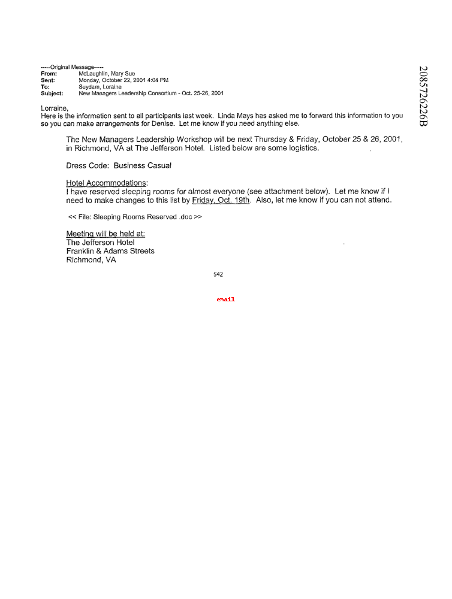

# LayoutLMv3 document classification
LayoutLMv3 is a pre-trained language model developed by Microsoft. It is designed to handle document analysis tasks that require understanding of both text and layout information, such as document classification, information extraction, and question answering.

In this project, we fine-tuned pre-trained LayoutLMv3 model for Document classification on the Document Classification Dataset from Kaggle. 
This is a small subset of rvl cdip dataset. It contains 3 out of 16 classes present in the rvl cdip dataset:
1.	email
2.	resume
3.	scientific_publication

## Inference

Documents can be tested using LayoutLMv3_inference notebook or using docker image   

docker image has been shared in github container registry, it can be pulled from    

  'ghcr.io/tahiriltaf/document_classification/dl_assignment_px_tahir:latest'  

and image can passed as enviroment  

 'docker run -e IMAGE_NAME=tst_image.png -v /absolute/path/to/images_dir:/images_dir dl_assignment_px_tahir'

 tst_image.png: name of image, (change accordingly)   
 /absolute/path/to/images_dir: absolute path of folder in host containing image (change accordingly)   
 /images_dir : directory within the container (donot change)   
 dl_assignment_px_tahir: the name of the Docker image that the container is based based on  

 the output with prediction is saved in directory mounted   

